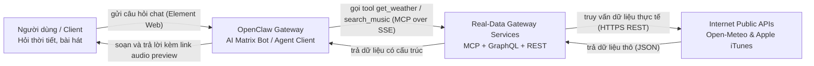
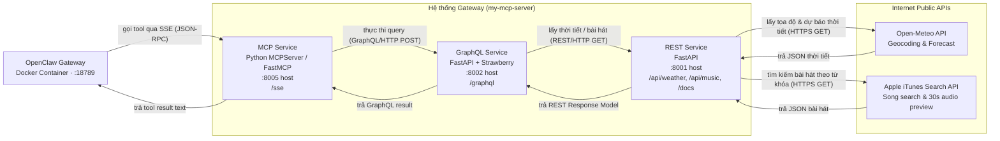
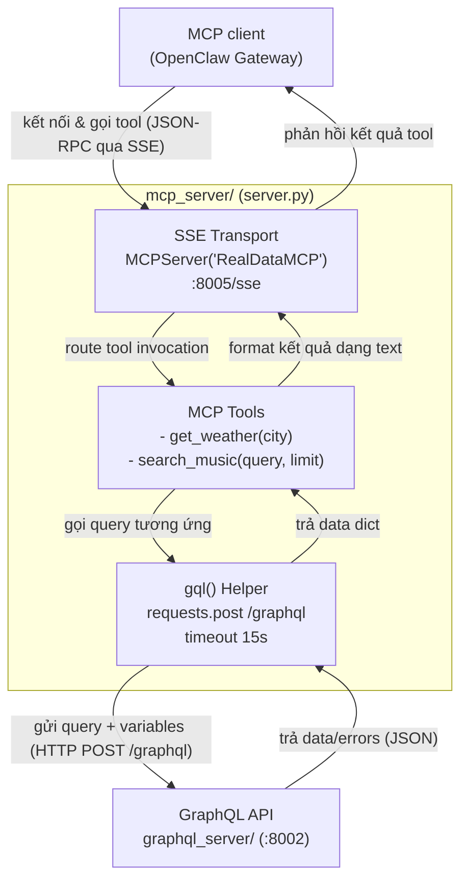
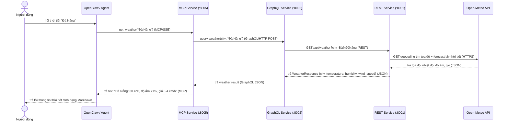
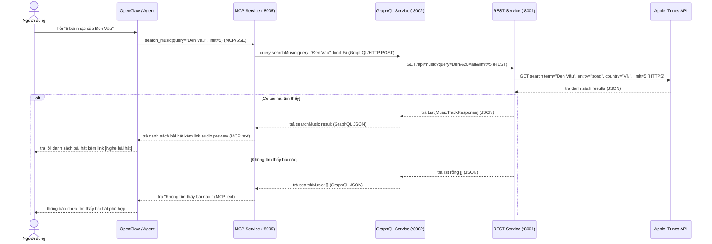

# Architecture report — Real-Data MCP Gateway (Weather & Music demo)

> Phạm vi: các service đang có trong repository `my-mcp-server`. C1/C2/C3 theo C4 model; hai sequence mô tả hai luồng người dùng chính.  
> Nguồn đối chiếu: `mcp_server/server.py`, `graphql_server/`, `rest_server/main.py`, `docs/`.

## 1. Mục tiêu và phạm vi

Hệ thống Gateway cung cấp dữ liệu thực tế thời gian thực (thời tiết, âm nhạc) từ Internet cho Trợ lý ảo AI (OpenClaw) theo chuẩn **Model Context Protocol (MCP)**. OpenClaw đóng vai trò là client/agent gọi MCP; MCP không tự sinh câu trả lời mà chuyển các tool call xuống GraphQL, rồi GraphQL tổng hợp và lấy dữ liệu từ REST API nội bộ. REST API chịu trách nhiệm trực tiếp gọi các Public API bên ngoài (Open-Meteo, Apple iTunes) và chuẩn hóa dữ liệu.

Các port khi chạy local:
- **REST Service:** `8001` (`/api/weather`, `/api/music`, Swagger UI `/docs`)
- **GraphQL Service:** `8002` (`/graphql`)
- **MCP Service:** `8005` (Transport SSE tại `/sse`)
- **OpenClaw Gateway:** `18789` (Matrix Bot chạy trong Docker, kết nối Matrix Synapse `8008` và Element Web `8080`)

---

## 2. C1 — System Context

**Ranh giới:** Giao diện chat (Element Web) và Matrix Synapse đóng vai trò hạ tầng kênh chat (Chat Platform). Report này tập trung vào chuỗi pipeline Gateway cung cấp dữ liệu thực tế cho OpenClaw Agent.

---

## 3. C2 — Container Diagram

| Container | Trách nhiệm chính | Giao tiếp ra ngoài |
|---|---|---|
| **OpenClaw Gateway** | Chạy AI Agent (GPT-4o-mini), lắng nghe tin nhắn Matrix và gọi MCP tool | MCP service qua SSE (`http://host.docker.internal:8005/sse`) |
| **MCP Service** | Expose các tool `get_weather(city)`, `search_music(query, limit)` theo chuẩn MCP | GraphQL service qua HTTP POST (`/graphql`) |
| **GraphQL Service** | Định nghĩa schema thống nhất (`Weather`, `MusicTrack`), gom nguồn dữ liệu REST | REST service qua HTTP GET |
| **REST Service** | Validate dữ liệu Pydantic, gọi Public APIs Open-Meteo và Apple iTunes | Internet APIs qua HTTPS |

---

## 4. C3 — Component Diagram (MCP Service)

**Điểm cần lưu ý trong C3:**
- Hàm `gql()` có timeout 15 giây và raise `RuntimeError` khi GraphQL trả về field `errors`.
- Tool `search_music` hỗ trợ tham số mặc định `limit = 3` nếu caller không chỉ định số lượng.
- Khi khởi động lại MCP Service, caller cần thực hiện lại bắt tay `initialize` để tránh mã lỗi `-32602` (`INVALID_PARAMS`).

---

## 5. Sequence 1 — Tra cứu thời tiết

Ví dụ câu hỏi: “Thời tiết ở Đà Nẵng như nào?”. Tool tương ứng: `get_weather(city="Đà Nẵng")`.

---

## 6. Sequence 2 — Tìm kiếm bài hát theo số lượng

Ví dụ câu hỏi: “5 bài nhạc của Đen Vâu”. Tool tương ứng: `search_music(query="Đen Vâu", limit=5)`.

---

## 7. Ghi chú vận hành và giới hạn hiện tại

- **Chuỗi gọi đồng bộ:** OpenClaw ➡️ MCP ➡️ GraphQL ➡️ REST ➡️ Public APIs; toàn bộ thực thi theo mô hình request-response đồng bộ, không sử dụng message broker hay caching.
- **Cấu hình Endpoint:** `GRAPHQL_URL` và `REST_API_URL` hiện trỏ trực tiếp loopback `http://127.0.0.1`. Khi container hóa toàn bộ hệ thống bằng Docker Compose, các URL này có thể được chuyển sang sử dụng biến môi trường (`os.getenv`).
- **Xử lý số lượng bài hát:** `search_music` tự động fallback về `limit = 3` nếu prompt của người dùng không chứa số lượng bài cụ thể; API iTunes được cấu hình mặc định vùng Việt Nam (`country="VN"`).
- **Endpoint kiểm tra (Health & Docs):** 
  - REST Service: Swagger UI tại `http://127.0.0.1:8001/docs`.
  - GraphQL Service: Interactive GraphQL Playground tại `http://127.0.0.1:8002/graphql`.
  - MCP Service: SSE stream lắng nghe tại `http://0.0.0.0:8005/sse`.
