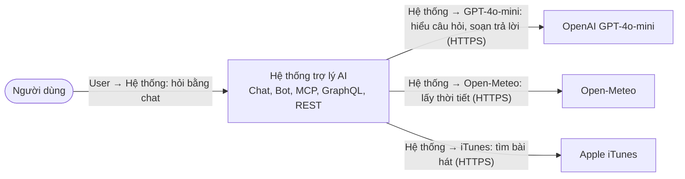
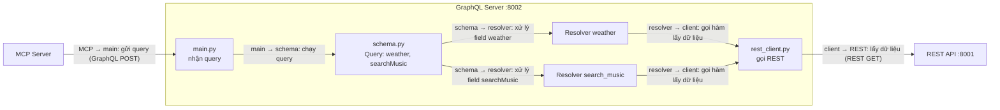
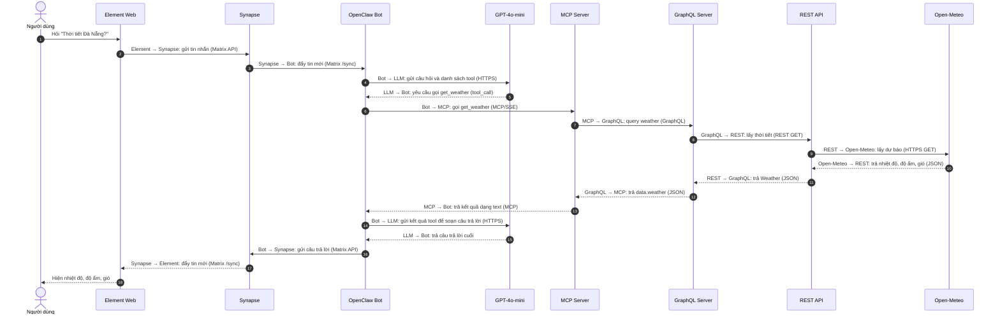
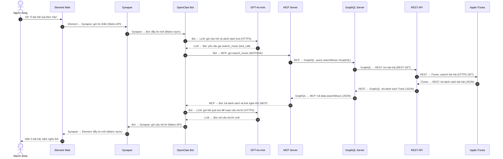

# Architecture report — Real-Data MCP Gateway (Weather & Music demo)

> Phạm vi: các service đang có trong repository `my-mcp-server`. C1/C2/C3 theo C4 model; hai sequence mô tả hai luồng người dùng chính.  
> Nguồn đối chiếu: `mcp_server/server.py`, `graphql_server/`, `rest_server/main.py`, `docs/`.

## 1. Mục tiêu và phạm vi

Hệ thống Gateway cung cấp dữ liệu thực tế thời gian thực (thời tiết, âm nhạc) từ Internet cho Trợ lý ảo AI (OpenClaw) theo chuẩn **Model Context Protocol (MCP)**. OpenClaw đóng vai trò là client/agent gọi MCP; MCP không tự sinh câu trả lời mà chuyển các tool call xuống GraphQL, rồi GraphQL tổng hợp và lấy dữ liệu từ REST API nội bộ. REST API chịu trách nhiệm trực tiếp gọi các Public API bên ngoài (Open-Meteo, Apple iTunes) và chuẩn hóa dữ liệu.

Các port khi chạy local:
- **REST Service:** `8001` (`/api/weather`, `/api/music`, Swagger UI `/docs`)
- **GraphQL Service:** `8002` (`/graphql`)
- **MCP Service:** `8005` (Transport SSE tại `/sse`)
- **OpenClaw Gateway:** `18789` (Matrix Bot chạy trong Docker, kết nối Matrix Synapse `8008` và Element Web `8080`)

---

## 2. C1 — System Context

**Ranh giới:** Giao diện chat (Element Web) và Matrix Synapse đóng vai trò hạ tầng kênh chat (Chat Platform). Report này tập trung vào chuỗi pipeline Gateway cung cấp dữ liệu thực tế cho OpenClaw Agent.

---

## 3. C2 — Container Diagram

```mermaid
flowchart LR
    U(["Người dùng"])
    EL["Element Web :8080<br/>React"]
    SY["Synapse :8008<br/>Matrix server"]
    OC["OpenClaw Bot<br/>Docker"]
    LLM["OpenAI GPT-4o-mini"]
    MCP["MCP Server :8005<br/>Python, SSE"]
    GQL["GraphQL Server :8002<br/>Strawberry"]
    REST["REST API :8001<br/>FastAPI"]
    OM["Open-Meteo"]
    IT["Apple iTunes"]

    U -->|"User → Element: gõ câu hỏi (Web UI)"| EL
    EL -->|"Element → Synapse: gửi tin nhắn (Matrix API)"| SY
    SY -->|"Synapse → Bot: đẩy tin mới (Matrix /sync)"| OC
    OC -->|"Bot → GPT-4o-mini: hiểu câu hỏi, chọn tool (HTTPS)"| LLM
    OC -->|"Bot → MCP: gọi tool (MCP/SSE)"| MCP
    MCP -->|"MCP → GraphQL: truy vấn dữ liệu (GraphQL)"| GQL
    GQL -->|"GraphQL → REST: lấy dữ liệu (REST GET)"| REST
    REST -->|"REST → Open-Meteo: lấy thời tiết (HTTPS GET)"| OM
    REST -->|"REST → iTunes: tìm bài hát (HTTPS GET)"| IT
```

| Container | Trách nhiệm chính | Giao tiếp ra ngoài |
|---|---|---|
| **Element Web** | Giao diện chat người dùng (React SPA :8080) | Gửi/nhận tin qua Matrix API với Synapse |
| **Matrix Synapse** | Homeserver chat nội bộ (:8008), quản lý phòng chat và sự kiện | Cung cấp Matrix Client-Server API |
| **OpenClaw Bot** | Chạy agent trong Docker (:18789), nhận tin nhắn Matrix, tương tác LLM | Kết nối Synapse qua Matrix API, gọi MCP qua SSE |
| **OpenAI GPT-4o-mini** | Mô hình ngôn ngữ lớn (LLM), phân tích intent và soạn câu trả lời | Nhận/trả qua HTTPS REST API |
| **MCP Server** | Expose các tool `get_weather`, `search_music` theo chuẩn MCP (:8005/sse) | Gửi GraphQL query qua HTTP POST |
| **GraphQL Server** | Cung cấp schema/truy vấn thống nhất (:8002/graphql), chuyển sang REST | REST service qua HTTP GET |
| **REST API** | Validate Pydantic, trực tiếp gọi Internet APIs và chuẩn hóa dữ liệu (:8001) | HTTPS GET tới Open-Meteo & Apple iTunes |

---

## 4. C3 — Component Diagram (GraphQL Server)

**Điểm cần lưu ý trong C3:** 
- `rest_client.py` có timeout 10 giây cho mỗi request tới REST API và kiểm tra HTTP status code; trường hợp 404 thành phố sẽ raise `ValueError`.
- Strawberry GraphQL Schema ánh xạ dữ liệu JSON từ REST sang GraphQL Type (`Weather`, `MusicTrack`), đảm bảo kiểm soát kiểu dữ liệu chặt chẽ trước khi trả về cho MCP Server.

---

## 5. Sequence 1: Hỏi thời tiết

Ví dụ câu hỏi: “Thời tiết Đà Nẵng?”. Tool tương ứng: `get_weather(city="Đà Nẵng")`.

---

## 6. Sequence 2: Tìm nhạc

Ví dụ câu hỏi: “5 bài hát của Đen Vâu”. Tool tương ứng: `search_music(query="Đen Vâu", limit=5)`.

---

## 7. Ghi chú vận hành và giới hạn hiện tại

- **Chuỗi gọi đồng bộ:** OpenClaw ➡️ MCP ➡️ GraphQL ➡️ REST ➡️ Public APIs; toàn bộ thực thi theo mô hình request-response đồng bộ, không sử dụng message broker hay caching.
- **Cấu hình Endpoint:** `GRAPHQL_URL` và `REST_API_URL` hiện trỏ trực tiếp loopback `http://127.0.0.1`. Khi container hóa toàn bộ hệ thống bằng Docker Compose, các URL này có thể được chuyển sang sử dụng biến môi trường (`os.getenv`).
- **Xử lý số lượng bài hát:** `search_music` tự động fallback về `limit = 3` nếu prompt của người dùng không chứa số lượng bài cụ thể; API iTunes được cấu hình mặc định vùng Việt Nam (`country="VN"`).
- **Endpoint kiểm tra (Health & Docs):** 
  - REST Service: Swagger UI tại `http://127.0.0.1:8001/docs`.
  - GraphQL Service: Interactive GraphQL Playground tại `http://127.0.0.1:8002/graphql`.
  - MCP Service: SSE stream lắng nghe tại `http://0.0.0.0:8005/sse`.
