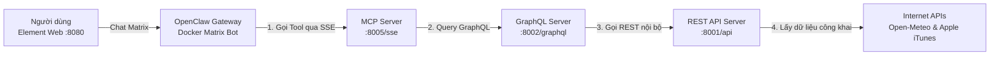
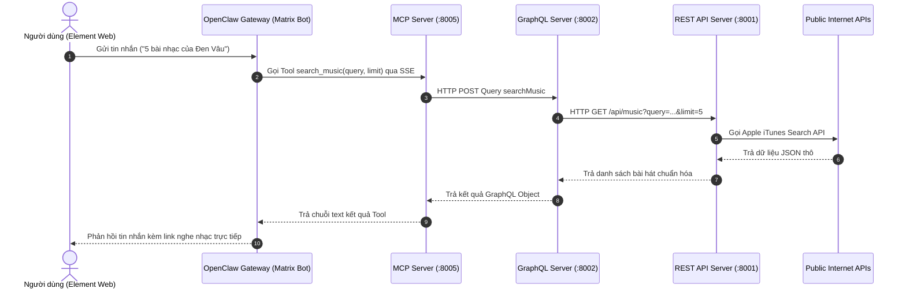

# Hệ Thống Gateway MCP - Real Data Pipeline (OpenClaw + Element)

Dự án này triển khai một chuỗi xử lý dữ liệu thực tế nhiều tầng (**Multi-tier Data Pipeline**) theo chuẩn **Model Context Protocol (MCP)**, cho phép AI Agent (**OpenClaw**) tự động tra cứu dữ liệu thời gian thực (thời tiết, âm nhạc) từ Internet và trả lời người dùng trên giao diện chat **Element Web (Matrix)**.

---

## 1. Sơ đồ Kiến trúc & Luồng hoạt động (Architecture & Data Flow)

Hệ thống hoạt động theo mô hình 5 tầng khép kín:



### Luồng tương tác tuần tự (Request - Response Flow):



### Các bước xử lý chi tiết:
1. **Người dùng gửi yêu cầu:** Gõ tin nhắn trong phòng chat Element Web (ví dụ: *"Thời tiết Hà Nội hôm nay thế nào?"* hoặc *"5 bài nhạc của Đen Vâu"*).
2. **OpenClaw Agent phân tích:** LLM (GPT-4o / GPT-4o-mini) nhận diện ngữ cảnh và quyết định gọi công cụ tương ứng (`get_weather` hoặc `search_music`).
3. **MCP Server điều phối:** Tiếp nhận lệnh gọi tool qua chuẩn JSON-RPC SSE, tạo truy vấn GraphQL tương ứng và gửi sang GraphQL Server.
4. **GraphQL Server tối ưu:** Tiếp nhận câu query GraphQL, gọi hàm xử lý tương ứng từ REST Client để lấy đúng các trường dữ liệu cần thiết.
5. **REST API Server lấy dữ liệu thực:**
   - **Thời tiết:** Gọi Open-Meteo Geocoding để lấy tọa độ theo tên thành phố, sau đó gọi Open-Meteo Forecast để lấy nhiệt độ, độ ẩm, sức gió.
   - **Âm nhạc:** Gọi Apple iTunes Search API với mã quốc gia `VN` để lấy danh sách bài hát, ca sĩ, album và link audio preview 30s.
6. **Tổng hợp & Phản hồi:** Dữ liệu thực tế đi ngược lại luồng trên, LLM nhận kết quả thô, định dạng thành tin nhắn Markdown đẹp mắt (kèm link nghe nhạc) và gửi lại phòng chat cho người dùng.

---

## 2. Cấu trúc thư mục (Project Structure)

```text
my-mcp-server/
│
├── rest_server/                  # TẦNG 1: REST API (Cổng 8001)
│   └── main.py                   # FastAPI service gọi trực tiếp Internet APIs (Open-Meteo, iTunes)
│
├── graphql_server/               # TẦNG 2: GraphQL Server (Cổng 8002)
│   ├── main.py                   # FastAPI server mount endpoint Strawberry GraphQL (/graphql)
│   ├── schema.py                 # Định nghĩa kiểu dữ liệu (Weather, MusicTrack) & Root Query
│   └── rest_client.py            # Client gọi nội bộ sang REST API Server (8001)
│
├── mcp_server/                   # TẦNG 3: MCP Server (Cổng 8005)
│   └── server.py                 # FastMCP / MCPServer triển khai SSE transport & các tool MCP
│
├── docs/                         # TÀI LIỆU & SCHEMA SPECIFICATIONS
│   ├── openapi.yaml              # Đặc tả chuẩn OpenAPI 3.1 của REST API
│   └── schema.graphql            # Đặc tả chuẩn GraphQL Schema
│
├── requirements.txt              # Danh sách thư viện Python cần thiết
└── README.md                     # Tài liệu hướng dẫn kiến trúc & vận hành
```

